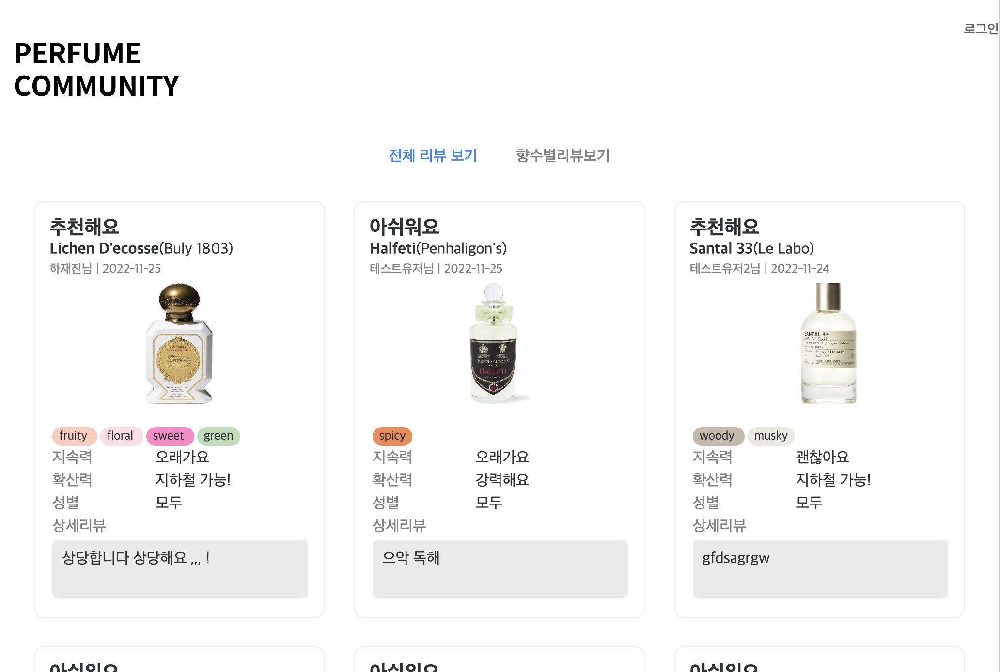

# [side-project]향수 리뷰 커뮤니티
<a href="http://49.247.33.119">

</a>
<br/>

---

# 목차

- [개요](#개요)
- [Stack](#Stack)
- [기능](#)
- [데이터](#)
- [사용자 인터페이스](#)
- [구현](#구현)
- [리뷰](#리뷰)

<br/>
<br/>

# 개요

개인적으로 향수 리뷰를 기록하고, 제품 및 브랜드 별로 다른 사용자들의 리뷰를 조회할 수 있는 커뮤니티 시스템.

<br/>
<br/>

# Stack

🌏 Language - `javacript`  
🎈 Framework - `vue` `express`  
💾 DBMS - `mysql`  
🎀 Style - `element-ui`

<br/>
<br/>

# 기능

- 로그인, 회원가입 기능
- 리뷰 조회, 등록, 수정, 삭제 가능
- 제품별 리뷰 통계 조회 기능
- 관리자 : 향수 및 브랜드 조회, 등록, 수정, 삭제 기능

<br/>
<br/>

# 데이터

- 사용자 데이터
- 브랜드 데이터
- 향수 데이터
- 리뷰 데이터

<br/>
<br/>

# 사용자 인터페이스

📄 메인페이지<br/>

- 등록된 전체 리뷰 조회
- 향수 제품별 등록된 리뷰 통계 조회

📄 로그인 페이지<br/>

- 아이디, 비밀번호 입력창
- 회원가입 페이지로 이동하는 버튼

📄 개인페이지<br/>

- 사용자 개인 정보 수정
- 본인이 작성한 리뷰 조회

📄 리뷰 수정 페이지<br/>

- 작성한 리뷰 수정
- 작성한 리뷰 삭제

📄 리뷰등록페이지<br/>

- 브랜드명, 제품명, 간단리뷰, 지속력, 확산력, 향조 키워드, 상세 리뷰 등 입력 가능

📄 관리자 페이지<br/>

- 관리자 계정으로 로그인 시 제품을 등록할 수 있는 페이지

<br/>
<br/>

# 구현
## 🔨 api

```yaml
# /api/router
├── brands.js       # 브랜드 리스트 조회, 등록, 검색
├── perfumes.js     # 향수 리스트 조회, 개별 조회, 등록, 수정, 검색, 향수별 리뷰 통계 조회
├── reviews.js      # 리뷰 리스트 조회, 개별 조회, 등록, 수정, 삭제
└── users.js        # 로그인, 로그인 체크, 회원가입, 아이디 중복체크, 정보 수정, 유저별 리뷰 조회

# /api/server.js : import router modules
```

## 💻 ui

```yaml
# /ui/src/components
├── AppFooter.vue
├── AppHeader.vue
├── NavBar.vue
├── ReviewCard.vue      # 리뷰 카드 컴포넌트
└── ReviewModal.vue     # 리뷰 조회 모달 컴포넌트

# /ui/src/views
├── ErrorPage.vue           # 에러페이지
├── adminViews              # 관리자 view
│   ├── AddBrand.vue        # 브랜드 등록 페이지
│   ├── AddPerfume.vue      # 향수 등록 페이지
│   ├── AdminMain.vue       # 관리자 메인페이지
│   ├── BrandList.vue       # 브랜드 리스트 조회 페이지
│   ├── PerfumeList.vue     # 향수 리스트 조회 페이지
│   └── UpdatePerfume.vue   # 향수 수정
├── reviewViews             # 리뷰 view
│   ├── AddReview.vue       # 리뷰 등록 페이지
│   ├── AllReviews.vue      # 전체 리뷰 리스트 조회 페이지
│   ├── PerfumeReview.vue   # 개인 리뷰 조회 페이지
│   ├── ReviewMain.vue      # 리뷰 메인 페이지
│   └── UpdateReview.vue    # 리뷰 수정 페이지
└── userViews               # 유저 view
    ├── MyPage.vue          # 유저 개인 페이지
    ├── SignIn.vue          # 로그인 페이지
    ├── SignUp.vue          # 회원가입 페이지
    └── UpdateUser.vue      # 회원 정보 수정 페이지
```

<br/>
<br/>

# 리뷰
- 처음 vue, express를 학습 후 3주 정도 소요해 완성한 사이드 프로젝트입니다.
- 리뷰 등록, 수정 페이지와 향수 등록, 수정페이지의 구성이 거의 동일 ->  컴포넌트화를 통해 리팩토링 하면 좋을 것 같습니다.
- 향수 삭제 기능, 브랜드 삭제 기능이 추가되면 좋을 것 같습니다.
- 전체 리뷰 통계 조회 ui가 아쉽습니다.
- 더미 데이터를 입력해 다양한 테스트 및 조회를 할 수 있었으면 좋을 것 같습니다.
